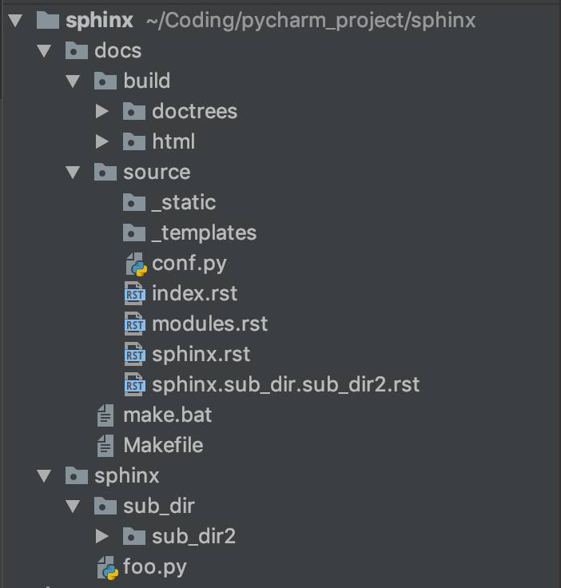
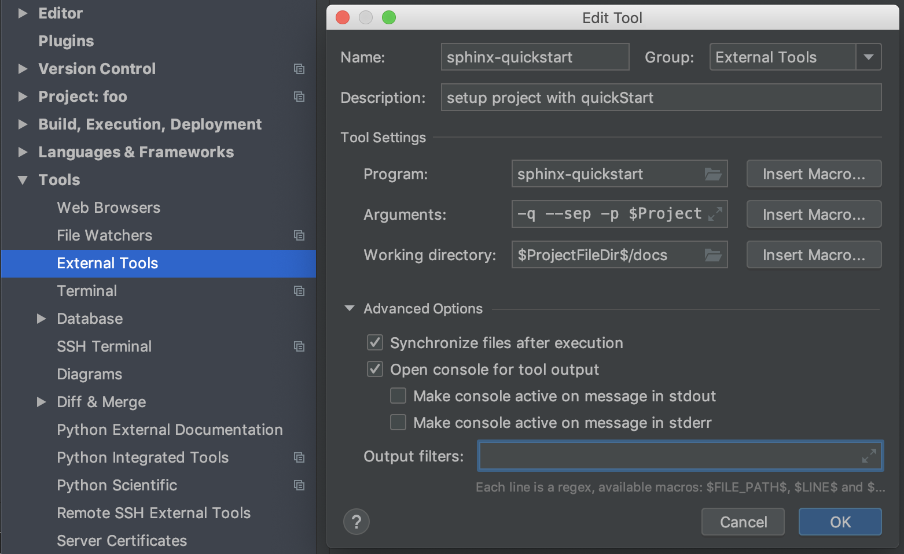
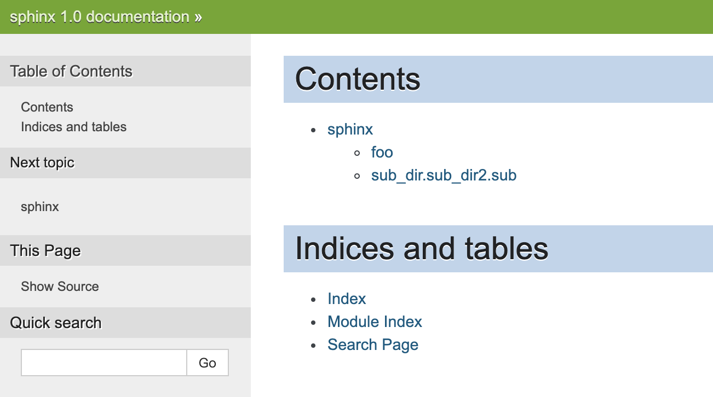

<!-- MarkdownTOC -->

- [1 前提](#1-前提)
    - [1.1 注释规范](#11-注释规范)
    - [1.2 目录结构](#12-目录结构)
- [2 DocStrings](#2-docstrings)
    - [2.1 Installing Sphinx](#21-installing-sphinx)
    - [2.2 Setup your Project with QuickStart](#22-setup-your-project-with-quickstart)
        - [2.2.1 交互式](#221-交互式)
        - [2.2.2 非交互式](#222-非交互式)
    - [2.3 Adjusting the conf.py File](#23-adjusting-the-confpy-file)
    - [2.4 Generate Docs](#24-generate-docs)
    - [2.5 Update index.rst and modules.rst](#25-update-indexrst-and-modulesrst)
    - [2.6 Make Html](#26-make-html)

<!-- /MarkdownTOC -->

<a id="1-前提"></a>
# 1 前提
<a id="11-注释规范"></a>
## 1.1 注释规范
代码按照 docStrings 规范进行注释：
```Python
# !/usr/bin/env python
# -*- coding: utf-8 -*-

"""
    * @Description: code style
    * @Author: xiong
    * @Version: 1.0
    * @Since: python3.7
    * @Time: 2019-10-04
"""


class Foo:
    """Docstring for class foo."""

    #: Doc comment for class attribute foo.bar.
    #: It can have multiple lines.
    bar = 1

    flo = 1.5   #: Doc comment for foo.flo.

    baz = 2
    """
    Docstring for class attribute foo.baz,
    can be multi-lines.
    """

    def __init__(self, qux, spm):
        """
        构造函数
        :param qux: qux to be set
        :param spm: spm to be set
        """
        #: Doc comment for instance attribute qux.
        self.qux = qux

        """Docstring for instance attribute spam."""
        self.spam = spm
```


<a id="12-目录结构"></a>
## 1.2 目录结构
[python 软件目录结构规范建议](https://cloud.tencent.com/developer/article/1175298)：
```
foo/  
|-- bin/  
|   |-- foo
|
|-- foo/
|   |-- tests/
|   |   |-- __init__.py
|   |   |-- test_main.py
|   |
|   |-- __init__.py
|   |-- main.py
|
|-- docs/
|   |-- conf.py
|   |-- abc.rst
|
|-- setup.py
|-- requirements.txt
|-- README
```

* bin/: 存放项目的一些可执行文件，当然你可以起名script/之类的也行

* foo/: 存放项目的所有源代码
    - 源代码中的所有模块、包都应该放在此目录，不要置于顶层目录
    - 其子目录 tests/ 存放单元测试代码
    - 程序的入口最好命名为main.py

* docs/: 存放一些文档

* setup.py: 安装、部署、打包的脚本

* requirements.txt: 存放软件依赖的外部Python包列表

* README: 项目说明文件


<a id="2-docstrings"></a>
# 2 DocStrings
本次教程的简化目录结构如下，接下来的说明基于上述目录结构。  
{:height="40%" width="40%"}

<a id="21-installing-sphinx"></a>
## 2.1 Installing Sphinx
pip install sphinx

<a id="22-setup-your-project-with-quickstart"></a>
## 2.2 Setup your Project with QuickStart
<a id="221-交互式"></a>
### 2.2.1 交互式
* cd docs
* sphinx-quickstart
* 回答问题（以下问题建议回答，其他采用默认设置）
    - Project name: Foo
    - Author name(s): AuthorName
    - Project version: 1.0 
    - autodoc: automatically insert docstrings from modules (y/n) [n]: y

<a id="222-非交互式"></a>
### 2.2.2 非交互式
* cd docs

* [sphinx-quickstart命令](https://www.sphinx-doc.org/en/master/man/sphinx-quickstart.html)，部分选项说明：
    - -q, --quiet
        + 非交互模式
        + 需要设置 -p, -a and -v
    - --sep
        + If specified, separate source and build directories.
    - -p PROJECT, --project=PROJECT
        + Project name
    - -a AUTHOR, --author=AUTHOR
        + Author names
    - -v VERSION
        + Version of project
    - -l LANGUAGE, --language=LANGUAGE
        + 如需使用中文，zh_CN 表示简体中文
    - --ext-autodoc
        + Enable sphinx.ext.autodoc extension
    - --ext-mathjax
        + Enable sphinx.ext.mathjax extension

* Pycharm Tools 实现
    
    - Arguments: -q --sep -p \$ProjectName\$ -a XiongWangqi -v 1.0 -l zh_CN --ext-autodoc --ext-mathjax
    - 设置完成后，可通过菜单栏 Tools -> External Tools -> sphinx-quickstart 启动

**Attention**： sphinx 2.0 之后的版本的问题变少，自由度下降，可以考虑采用"非交互式"的命令行的方式


<a id="23-adjusting-the-confpy-file"></a>
## 2.3 Adjusting the conf.py File
* 在 Path setup 部分添加 **python 源文件路径**，这里的路径决定了基于 sphinx-apidoc 产生的 *.rst 文件生成 html 时，能否找到相应的 *.py 文件
    ```Python
    import os
    import sys
    sys.path.insert(0, os.path.abspath('../../sphinx'))
    ```

* 主题设置
    - 这里我们选择和 pandas 相同的 Sphinx 自带主题 nature，修改 con.py 文件的 Options for HTML output 部分
    ```Python
    html_theme = 'nature'
    ```
    - [采用了 Sphinx 的 python 项目的主题选择情况链接](https://www.sphinx-doc.org/en/master/examples.html)
    - [附上部分主题的模板展示链接](https://sphinx-themes.org)


<a id="24-generate-docs"></a>
## 2.4 Generate Docs
* cd docs

* [sphinx-apidoc命令](https://www.sphinx-doc.org/en/master/man/sphinx-apidoc.html)，部分选项说明：
    - -f 强制覆盖
    - --implicit-namespaces
        + By default sphinx-apidoc processes sys.path searching for modules only. Python 3.3 introduced PEP 420 implicit namespaces that allow module path structures such as foo/bar/module.py or foo/bar/baz/__init__.py (notice that bar and foo are namespaces, not modules)
    - -E, --no-headings
        + Do not create headings for the modules/packages
    - -o
        + Directory to place the output files. If it does not exist, it is created
    - OUTPUT_PATH
        + sphinx-quickstart 中生成的 sources 文件（夹）
    - MODULE_PATH
        + python 源代码文件夹

* Pycharm Tools 实现：
    
    - Arguments: -f --implicit-namespaces -E -o ./source ../\$ProjectName\$/
    - 设置完成后，可通过菜单栏 Tools -> External Tools -> sphinx-apidoc 启动 sphinx-apidoc


<a id="25-update-indexrst-and-modulesrst"></a>
## 2.5 Update index.rst and modules.rst
* index.rst 为主文件，其内容对应
```Rst
Contents
===============================

.. toctree::
   :maxdepth: 2

   modules

Indices and tables
==================

* :ref:`genindex`
* :ref:`modindex`
* :ref:`search`
```

* modules.rst 对应各个模块
`======`上方的文字为标题，会作为链接文字出现在调用该 rst 文件的 html 中，下同
```Rst
sphinx
======

.. toctree::
   :maxdepth: 4

   sphinx
   sphinx.sub_dir.sub_dir2
```


* 各模块对应的 .rst 文件
    - sphinx.rst 对应 foo.py  
    **可以将 automodule 的部分和 conf.py 中添加的路径连起来就是该 .rst 文件对应的 .py 文件的位置**，下同
    ```Rst
    foo
    ================

    .. automodule:: foo
       :members:
       :undoc-members:
       :show-inheritance:
    ```


    - sphinx.sub_dir.sub_dir2.rst 对应 sub.py
    ```Rst
    sub\_dir.sub\_dir2.sub
    ===================================

    .. automodule:: sub_dir.sub_dir2.sub
       :members:
       :undoc-members:
       :show-inheritance:
    ```


<a id="26-make-html"></a>
## 2.6 Make Html
* cd docs
* make html

* 效果如下



